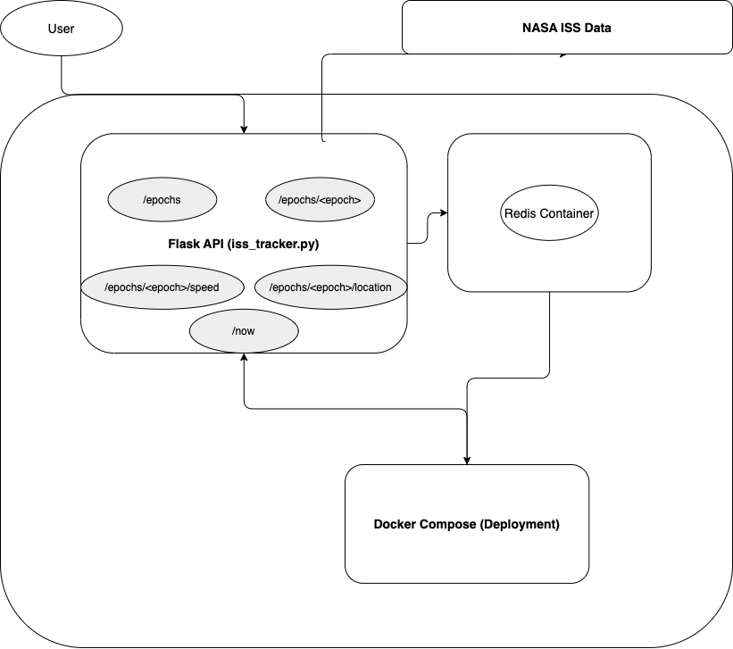

 Orbital Data API - Flask Application

 Overview
This project provides a Flask-based API to access and analyze orbital data. The application retrieves state vectors for various epochs, calculates instantaneous speed, and identifies the closest epoch in time. The application is fully containerized, making it easy to deploy and run in different environments.

 Data Source
The dataset used in this project is sourced from NASA's Spot The Station, (https://spotthestation.nasa.gov/trajectory_data.cfm) and provides real-time orbital parameters for tracking space objects. **Note:** The dataset itself is not included in this repository. Users must fetch the data independently.

 System Diagram
Below is a software diagram illustrating the architecture of the ISS Tracker project:



 Setup and Installation

 Clone the Repository
```bash
git clone <repository_url>
cd homework05
```

 Build the Docker Container
Ensure that Docker is installed and running. Then, build the container:
```bash
docker build -t orbital-api .
```

 Run the Flask Application Inside a Container
To run the application in a Docker container and expose it on port 5000:
```bash
docker run -p 5000:5000 orbital-api
```

 API Endpoints
The Flask application provides the following API endpoints:

 1. Get the Entire Dataset
**Route:**
```bash
GET /epochs
```
**Example cURL Command:**
```bash
curl -X GET http://127.0.0.1:5000/epochs
```
**Response:**
Returns the entire dataset of epochs.

 2. Get a Paginated List of Epochs
**Route:**
```bash
GET /epochs?limit=<int>&offset=<int>
```
**Example cURL Command:**
```bash
curl -X GET "http://127.0.0.1:5000/epochs?limit=5&offset=10"
```
**Response:**
Returns a modified list of epochs based on the limit and offset parameters.

 3. Get State Vectors for a Specific Epoch
**Route:**
```bash
GET /epochs/<epoch>
```
**Example cURL Command:**
```bash
curl -X GET "http://127.0.0.1:5000/epochs/2025-059T12:00:00.000Z"
```
**Response:**
Returns state vectors (position and velocity) for the specified epoch.

 4. Get Instantaneous Speed for a Specific Epoch
**Route:**
```bash
GET /epochs/<epoch>/speed
```
**Example cURL Command:**
```bash
curl -X GET "http://127.0.0.1:5000/epochs/2025-059T12:00:00.000Z/speed"
```
**Response:**
Returns the instantaneous speed (calculated from velocity components) for the specified epoch.

 5. Get State Vectors and Speed for the Nearest Epoch in Time
**Route:**
```bash
GET /now
```
**Example cURL Command:**
```bash
curl -X GET http://127.0.0.1:5000/now
```
**Response:**
Returns state vectors and instantaneous speed for the epoch closest to the current time.
 Notes
- Ensure the dataset is properly loaded before making requests.
- The application uses standard **ISO 8601 timestamps** (`YYYY-DDDTHH:MM:SS.sssZ`) for epochs.
- The API is designed to be easily extensible for additional functionality in the future.

